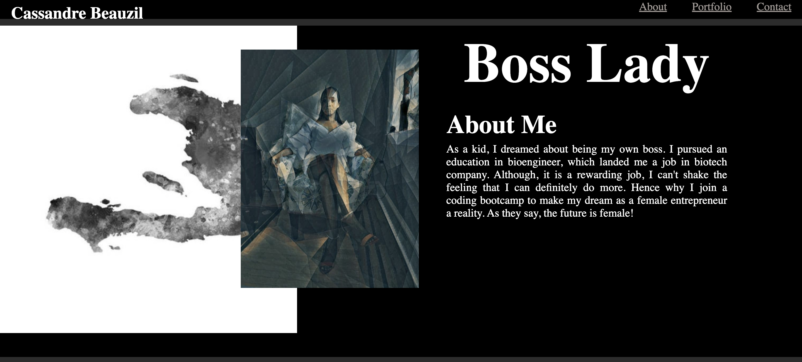

# My-Portfolio-

# My-Portfolio

## Description

As A developer, I WANT to create my portfolio So THAT can showcase my work to potential employees. 

## Installation

N/A

## Usage

Following the guidelines provided in the assignment module, the website should be able to open in small devices as well. To view the source code, or to retrieve the semantics HTML elements, and the CSS selectors it is suggested to use the Chrome DevTools.

## Notes

The following steps demonstrate the process:

* A new repository was created
* An HTML file was created to mimic reflect my progress in the bootcamp program
* Subsequently, the CSS file was created to follow the semantic structure of the HTML file 
* Comments were added to CSS file as a guide
* The repository was updated to reflect the changes

## License

MIT license

## Screenshot

## Website Link

file:///Users/cassie/bootcamp/code-refactor-/index.html
